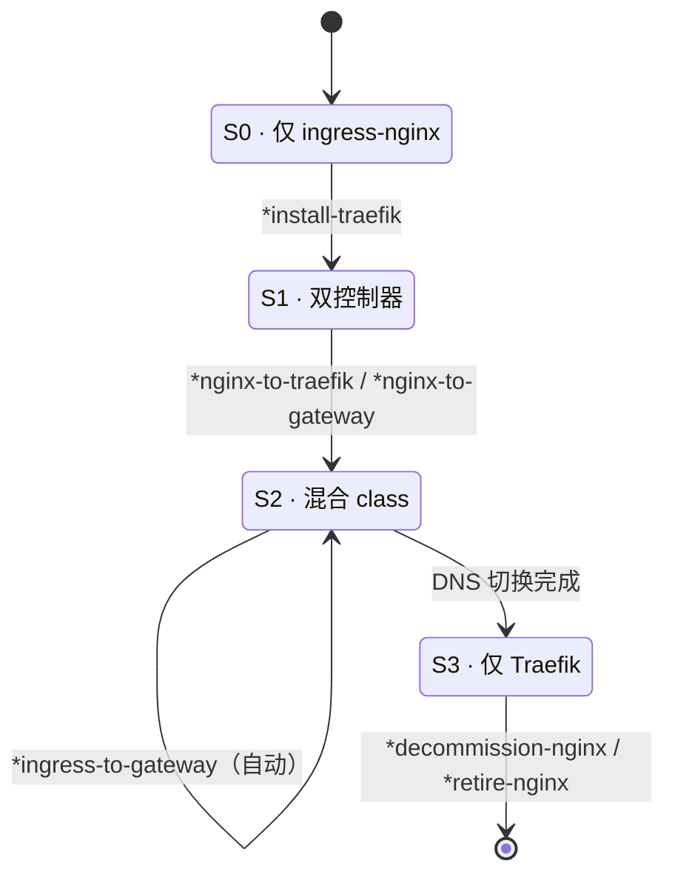

# ⚡ DevOps AI Skill Pack

[](https://www.npmjs.com/package/devops-ai-skill)
[](https://github.com/qwedsazxc78/devops-ai-skill/releases)
[](https://github.com/qwedsazxc78/devops-ai-skill)
[](https://github.com/qwedsazxc78/devops-ai-skill/blob/main/LICENSE)
[](#项目结构)
[](#技能模块)
[](#horus-流水线iac)
[](#agent-代理)
[](#平台支持)

> 跨平台 DevOps AI 技能包 — 两个 AI 驱动的 DevOps Agent 与共用流水线工作流，支持 **Claude Code**、**OpenAI Codex CLI**、**Google Gemini CLI** 和 **Google Antigravity**。

🚀 [快速开始](#快速开始) · 🤖 [Agent](#agent-代理) · 🔧 [工具安装](#工具安装) · 🛠️ [技能模块](#技能模块) · 📖 [安装指南](setup.md) · ⚡ [5 分钟上手](quick-start.zh-CN.md) · 🌐 [GitHub Repo](https://github.com/qwedsazxc78/devops-ai-skill)

[繁體中文](README.zh-TW.md) | [English](../README.md) | 简体中文

---

## Agent 代理

| Agent | 专注领域 | 平台 |
|-------|---------|------|
| **Horus** — IaC 运维工程师 | Terraform + Helm + GKE | 全平台 |
| **Zeus** — GitOps 工程师 | Kustomize + ArgoCD | 全平台 |

## 快速开始

### 全局安装（推荐）

一次安装，所有项目共用，无需 per-repo 设置。

**macOS / Linux：**

```bash
git clone https://github.com/qwedsazxc78/devops-ai-skill.git
cd devops-ai-skill
bash scripts/install-global.sh          # 自动检测已安装的 CLI
```

**Windows（一键安装）：**

```powershell
git clone https://github.com/qwedsazxc78/devops-ai-skill.git
cd devops-ai-skill
.\scripts\setup\install.bat              # 交互式菜单：skills / tools / both
```

或非交互执行：

```powershell
powershell -ExecutionPolicy Bypass -File scripts\install-global.ps1
```

自动检测 Claude Code / Codex CLI / Gemini CLI / Antigravity，安装至对应全局路径。Windows 脚本针对 PowerShell 5.1（Windows 10 / 11 内置），不需要 Git Bash 或 WSL。


> 🆕 **新手？** 请看 [5 分钟快速上手指南](quick-start.zh-CN.md)，零基础也能立刻开始！

<details>
<summary><strong>全局安装选项</strong></summary>

**macOS / Linux：**

```bash
bash scripts/install-global.sh --all            # 强制安装全部平台
bash scripts/install-global.sh --claude         # 仅 Claude Code
bash scripts/install-global.sh --codex          # 仅 Codex CLI
bash scripts/install-global.sh --gemini         # 仅 Gemini CLI
bash scripts/install-global.sh --antigravity    # 仅 Antigravity
bash scripts/install-global.sh --status         # 查看安装状态
bash scripts/install-global.sh --uninstall      # 移除全局安装
```

**Windows（PowerShell）：**

```powershell
powershell -ExecutionPolicy Bypass -File scripts\install-global.ps1 -All
powershell -ExecutionPolicy Bypass -File scripts\install-global.ps1 -Claude
powershell -ExecutionPolicy Bypass -File scripts\install-global.ps1 -Codex
powershell -ExecutionPolicy Bypass -File scripts\install-global.ps1 -Gemini
powershell -ExecutionPolicy Bypass -File scripts\install-global.ps1 -Antigravity
powershell -ExecutionPolicy Bypass -File scripts\install-global.ps1 -Status
powershell -ExecutionPolicy Bypass -File scripts\install-global.ps1 -Uninstall
```

或双击 `scripts\setup\install.bat`，使用交互式菜单（skills / tools / both / status / uninstall）。

</details>

<details>
<summary><strong>更新已安装的 Skills</strong></summary>

```bash
cd devops-ai-skill
git pull origin main                          # 拉取最新版本
bash scripts/install-global.sh                # 重跑安装（自动跳过未变动文件）
```

> 更新 source 后需重跑 `install-global.sh`，以同步变更至所有平台。

</details>

<details>
<summary><strong>Per-repo 安装（传统方式）</strong></summary>

在你的项目根目录执行（仅 macOS / Linux，使用 symlink）：

```bash
git clone https://github.com/qwedsazxc78/devops-ai-skill.git
bash devops-ai-skill/scripts/setup.sh --all    # 安装全部平台
bash devops-ai-skill/scripts/setup.sh          # 或交互选择平台
```

```bash
# 仅安装特定平台
bash devops-ai-skill/scripts/setup.sh --claude
bash devops-ai-skill/scripts/setup.sh --codex
bash devops-ai-skill/scripts/setup.sh --gemini
bash devops-ai-skill/scripts/setup.sh --antigravity

# 移除所有安装
bash devops-ai-skill/scripts/setup.sh --uninstall
```

> **Windows 用户：** Per-repo 流程依赖 Unix symlink（在 Windows 需要管理员或开发者模式）。请改用 **全局安装**（`scripts\setup\install.bat`），同样四平台齐全且不需要管理员权限。

</details>

<details>
<summary><strong>Marketplace（仅 Claude Code）</strong></summary>

```bash
/plugin marketplace add qwedsazxc78/devops-ai-skill
/plugin install devops@devops-ai-skill
```

</details>

<details>
<summary><strong>跨平台（npx skills）— 仅安装 Skills</strong></summary>

```bash
# 自动检测已安装的 AI Agent 并路由 Skills
npx skills add qwedsazxc78/devops-ai-skill

# 更新
npx skills update
```

> **⚠️ 注意：此方式仅安装 12 个 Skills（SKILL.md），不包含以下功能：**
>
> | 功能 | npx skills | 全局安装 |
> |------|:----------:|:--------:|
> | 12 个 Skills（SKILL.md） | ✅ | ✅ |
> | 2 个 Agent（Horus / Zeus） | ❌ | ✅ |
> | 17 条流水线（`*full`、`*security` 等） | ❌ | ✅ |
> | 命令面板（Gemini CLI） | ❌ | ✅ |
> | 工作流（Antigravity） | ❌ | ✅ |
>
> 如需完整体验，请使用上方的**全局安装**或 **Marketplace** 方式。

</details>

## 平台支持

| 功能 | Claude Code | OpenAI Codex | Gemini CLI | Antigravity |
|------|-------------|--------------|------------|-------------|
| 全局 Agents | `~/.claude/agents/` | `~/.codex/instructions.md` | `~/.gemini/agents/` | `~/.agents/skills/` |
| 全局 Skills | `~/.claude/skills/` | `~/.codex/skills/` | `~/.gemini/skills/` | 共用 `~/.gemini/skills/` |
| 命令面板 | — | — | `~/.gemini/commands/devops/` | — |
| 工作流 | — | — | — | `~/.agents/workflows/` |
| 入口文件 | `CLAUDE.md` | `AGENTS.md` | `GEMINI.md` | `.agents/rules/` |
| Skills 格式 | SKILL.md（原生） | SKILL.md（原生） | SKILL.md（原生） | SKILL.md（原生） |
| 流水线触发 | `*cmd` | `*cmd` | 命令面板 `devops:` | `/workflow-name` |
| Bash 执行 | Yes | Yes (`!cmd`) | Yes (`run_shell_command`) | Yes |

## 工具安装

一键安装所有必要工具，支持 macOS (Homebrew)、Linux (apt/snap)、Windows (winget/choco/scoop)、Python (uv/pip)。

**macOS / Linux：**

```bash
# 交互模式：检查 + 提示安装
./scripts/install-tools.sh

# 仅检查工具状态
./scripts/install-tools.sh check

# 安装全部缺少的工具
./scripts/install-tools.sh install

# 仅安装特定 Agent 的工具
./scripts/install-tools.sh install horus   # IaC 工具
./scripts/install-tools.sh install zeus    # GitOps 工具
```

**Windows（PowerShell，原生 — 不需要 Git Bash 或 WSL）：**

> ⚠️ **需要管理员权限：** 执行 `install-tools.ps1` 前，请以管理员身份打开 PowerShell。包管理工具（`winget`、`choco`、`scoop`）需要提升的权限才能安装系统工具。

```powershell
# 交互模式：检查并提示安装
.\scripts\install-tools.ps1

# 仅检查工具状态（不需要管理员）
.\scripts\install-tools.ps1 check

# 安装全部缺少的工具（需要管理员）
.\scripts\install-tools.ps1 install

# 安装特定 Agent 的工具（需要管理员）
.\scripts\install-tools.ps1 install horus
.\scripts\install-tools.ps1 install zeus
```

或双击 `scripts\setup\install.bat`，选择 `[2] Tools`（安装时需要管理员模式）。需要 `winget`（Windows 10 1809+ / Windows 11 内置）或 `choco` / `scoop`。

### 共用工具

| 工具 | 等级 | macOS (brew) | Linux (apt/snap) | Windows (winget) | 说明 |
|------|------|-------------|-------------------|------------------|------|
| node | 必要 | `brew install node` | `apt-get install nodejs` | `winget install OpenJS.NodeJS.LTS` | postinstall 运行环境 |
| git | 必要 | `brew install git` | `apt-get install git` | `winget install Git.Git` | 版本控制 |
| kubectl | 必要 | `brew install kubectl` | `snap install kubectl` | `winget install Kubernetes.kubectl` | K8s CLI |
| jq | 必要 | `brew install jq` | `apt-get install jq` | `winget install jqlang.jq` | JSON 处理 |
| yq | 建议 | `brew install yq` | `snap install yq` | `winget install MikeFarah.yq` | YAML 处理 |
| python3 | 建议 | `brew install python3` | `apt-get install python3` | `winget install Python.Python.3.12` | 版本验证脚本 |
| curl | 建议 | `brew install curl` | `apt-get install curl` | `winget install cURL.cURL` | 远程版本检查 |

### Horus 工具（IaC）

| 工具 | 等级 | macOS (brew) | Windows (winget/choco) | pip | 说明 |
|------|------|-------------|------------------------|-----|------|
| terraform | 必要 | `brew install terraform` | `winget install Hashicorp.Terraform` | — | IaC 引擎 |
| helm | 必要 | `brew install helm` | `winget install Helm.Helm` | — | Helm Chart 管理 |
| tflint | 建议 | `brew install tflint` | `choco install tflint` | — | Terraform Lint |
| tfsec | 建议 | `brew install tfsec` | `choco install tfsec` | — | Terraform 安全扫描 |
| pre-commit | 建议 | — | — | `pip install pre-commit` | Git Hook 管理 |

### Zeus 工具（GitOps）

| 工具 | 等级 | macOS (brew) | Windows (choco/scoop) | pip | 说明 |
|------|------|-------------|------------------------|-----|------|
| kustomize | 必要 | `brew install kustomize` | `scoop install kustomize` | — | Kustomize 构建 |
| yamllint | 建议 | — | — | `pip install yamllint` | YAML Lint |
| kubeconform | 建议 | `brew install kubeconform` | `scoop install kubeconform` | — | K8s 资源验证 |
| kube-score | 建议 | `brew install kube-score` | — | — | K8s 最佳实践 |
| kube-linter | 建议 | `brew install kube-linter` | — | — | K8s Lint |
| polaris | 建议 | `brew install FairwindsOps/tap/polaris` | — | — | K8s 策略检查 |
| pluto | 建议 | `brew install FairwindsOps/tap/pluto` | — | — | 废弃 API 检测 |
| conftest | 建议 | `brew install conftest` | — | — | 策略测试 |
| checkov | 建议 | — | — | `pip install checkov` | IaC 安全扫描 |
| trivy | 建议 | `brew install trivy` | `choco install trivy` | — | 漏洞扫描 |
| gitleaks | 建议 | `brew install gitleaks` | `choco install gitleaks` | — | 机密检测 |
| d2 | 建议 | `brew install d2` | `scoop install d2` | — | 架构图生成 |

## Horus 流水线（IaC）

| 流水线 | 说明 |
|--------|------|
| `*full` | 完整检查（执行 CLI 工具）+ 报告 |
| `*upgrade` | 升级 Helm Chart 版本 |
| `*security` | 安全性审计（文件分析） |
| `*validate` | 验证（fmt + 文件分析） |
| `*scaffold` | 创建新的 Helm 模块 |
| `*cicd` | 改善 CI/CD 流水线 |
| `*health` | 平台健康检查 |

## Zeus 流水线（GitOps）

| 流水线 | 说明 |
|--------|------|
| `*full` | 完整流水线 + YAML/MD 报告 |
| `*pre-merge` | 合并前基本检查 |
| `*health` | 仓库健康评估 |
| `*review` | MR 审查流水线 |
| `*scaffold` | 服务构建（交互式） |
| `*diagram` | 生成架构图 |
| `*status` | 工具安装状态检查 |
| `*gateway-migrate` | NGINX Ingress → Gateway API 迁移（默认 Traefik，可选 GKE via `--gateway-class gke-l7-*`） |
| `*nginx-to-traefik` | NGINX Ingress 类别替换为 Traefik Ingress，支持并行运行与 DNS A-record 切换 |
| `*nginx-to-gateway` | 链式 NGINX → Traefik → Gateway API 迁移，生成单一合并报告 |
| `*retire-nginx` | 迁移后 nginx 退役 — 删除控制器 ArgoCD app + `$patch: delete` 排除 base nginx Ingress，安全门控，单环境或 `all` |

## 架构图

由 Zeus `*diagram` pipeline 生成（引擎：[`devops:painter`](../skills/painter/SKILL.md)）。
每张图提供 **Mermaid**（下方/GitHub 直接渲染）与 **detailed Painter-HTML** 下钻版本，
详见[图库](diagrams/README.md)与[使用指南](diagrams-guide.md)。

### 迁移旅程 — ingress-nginx → Traefik → Gateway API



在 Zeus 中输入 `*migration-quickstart` 获取含示例的完整版。Zeus 与 Horus 拓扑图见[图库](diagrams/README.md)。

## 技能模块

所有技能遵循 [Open Agent Skills](https://agentskills.io/specification) 标准（SKILL.md + YAML frontmatter）。以 `devops:<技能>` 命名空间调用，或直接用自然语言描述需求，Agent 会自动路由到对应技能。

### 用户可见技能

| 技能 | 使用者 | 用途 |
|------|--------|------|
| devops:helm-version-upgrade | Horus | Helm Chart 版本管理 |
| devops:kustomize-resource-validation | Zeus | Kustomize 构建 + 验证 |
| devops:yaml-fix-suggestions | Zeus | YAML 格式修正 |
| devops:gateway-api-migration | Zeus | NGINX Ingress → Gateway API 迁移，支持状态追踪。v1.2.0 起双目标：默认 Traefik、可选 GKE Gateway。 |
| devops:nginx-to-traefik | Zeus | NGINX Ingress 类别替换为 Traefik Ingress，支持并行运行与 DNS A-record 切换。 |
| devops:nginx-to-gateway | Zeus | 薄协调器：在单一 session 中串联 nginx-to-traefik → gateway-api-migration，生成合并报告。 |
| devops:ingress-migration-advisor | Zeus | 只读 ingress-nginx EOL 规划工具（v1.12.0+）。5 维度评分、关键层级否决、sourceClass 快捷方式。 |
| devops:ingress-controller-install | Zeus | GitOps Traefik 安装/升级（v1.13.1+）。三种模式自动检测：bootstrap / new-env / upgrade。仅规划。 |
| devops:traefik-controller-decommission | Zeus | GitOps ingress-nginx 退役：模块存档 + ArgoCD 清除（v1.13.1+）。仅规划。 |
| devops:nginx-ingress-retire | Zeus | 迁移后 nginx 退役（v1.17.0+）：逐环境删除控制器 ArgoCD app + `$patch: delete` 排除 base nginx Ingress。安全门控。 |
| devops:release-validate | 共用 | 发布就绪验证 — Phase 4~7 全自动检查（fixture 测试、Shell 可移植性、跨库样式覆盖率、AI 工具同步）。(v1.15.0+) |

### Horus 内部指南

隐藏于命令面板，由 Horus Agent Pipeline 通过 `Read GUIDE.md` 调用：

| 指南 | 用途 |
|------|------|
| terraform-validate | 验证与 Lint |
| terraform-security | 安全性扫描 |
| helm-scaffold | 新模块生成 |
| cicd-enhancer | CI/CD 流水线改善 |

## 项目结构

```
devops-ai-skill/
├── CLAUDE.md                    # Claude Code 入口
├── AGENTS.md                    # OpenAI Codex 入口
├── GEMINI.md                    # Gemini CLI 入口
├── VERSION                      # 版本来源
│
├── .claude/                     # Claude Code 平台
│   ├── settings.json
│   ├── agents/
│   │   ├── horus.md
│   │   └── zeus.md
│   └── skills/ → symlink to skills/
│
├── .codex/                      # OpenAI Codex 平台
│   ├── config.toml
│   └── skills/ → symlink to skills/
│
├── .gemini/                     # Google Gemini 平台
│   ├── settings.json
│   ├── agents/
│   │   ├── horus.md
│   │   └── zeus.md
│   ├── commands/devops/          # 命令面板 TOML 文件
│   │   ├── agents/               # 2 agent 启动命令
│   │   └── pipelines/            # 24 pipeline 命令
│   └── extensions/devops/
│       └── gemini-extension.json
│
├── .agents/                     # Google Antigravity 平台
│   ├── rules/devops.md
│   ├── skills/
│   │   ├── horus/SKILL.md
│   │   ├── zeus/SKILL.md
│   │   └── (17 skill symlinks)
│   └── workflows/               # symlinks → prompts/
│
├── skills/                      # 共用技能（Open Agent Skills 标准）
│   ├── terraform-validate/
│   ├── terraform-security/
│   ├── helm-version-upgrade/
│   ├── helm-scaffold/
│   ├── cicd-enhancer/
│   ├── kustomize-resource-validation/
│   ├── yaml-fix-suggestions/
│   └── repo-detect/
│
├── prompts/                     # 平台中立的流水线定义
│   ├── horus/                   # 7 条流水线
│   ├── zeus/                    # 15 条流水线
│   └── shared/                  # repo-detect, report-format, tool-check
│
├── scripts/
│   ├── setup.sh                    # 统一安装脚本（推荐）
│   ├── install-tools.sh
│   ├── version-check.sh
│   └── setup/
│       ├── setup-claude.sh         # 平台专用（内部安装）
│       ├── setup-codex.sh
│       ├── setup-gemini.sh
│       └── setup-antigravity.sh
│
├── .claude-plugin/              # Claude Code marketplace
│   ├── plugin.json
│   └── marketplace.json
│
└── docs/
    ├── quick-start.md           # 5 分钟快速上手
    ├── setup.md                 # 详细安装指南
    └── guide/                   # 教程截图（即将推出）
```

## 版本检查

```bash
bash scripts/version-check.sh
```

## 更新

```bash
# Git
git pull origin main

# 或指定版本
git checkout v<version>

# 或 npx skills
npx skills update
```

## 设计原则

- **无硬编码路径** — 两个 Agent 都动态发现目录
- **优雅降级** — 缺少工具时跳过检查并显示安装命令
- **用户控制** — 重大操作（如 terraform init）总是询问用户
- **动态发现** — 每个 skill 定义「Step 0: 发现 Repository 布局」

## 授权

MIT
