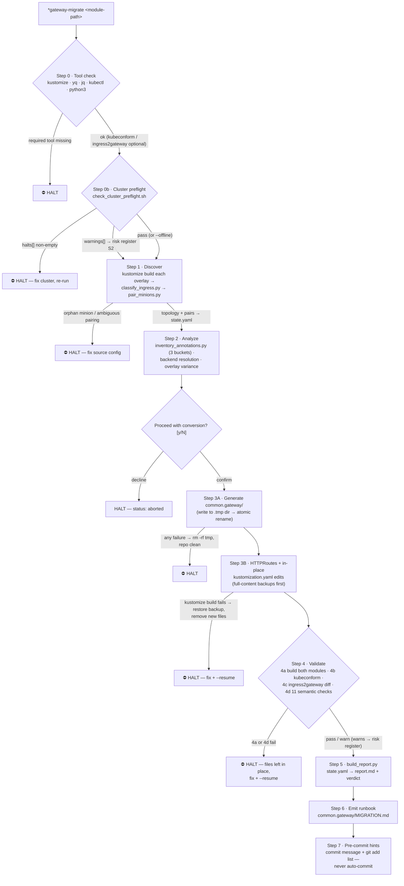

# gateway-api-migration — NGINX Ingress → Gateway API

The `*gateway-migrate` Zeus command (skill: `devops:gateway-api-migration`, v1.2.0) turns an
NGINX Ingress footprint (master/minion or standalone) into a side-by-side Gateway API
deployment so a per-hostname DNS cutover can proceed at the operator's pace. It is
dual-target — default Traefik (`GatewayClass=traefik`), opt-in GKE Gateway via
`--gateway-class gke-l7-*` — and every deterministic step is delegated to a bundled script
while the model interprets output and writes the report.

**Key invariants:**

- **The master source is never modified.** `common.ingress/` is read-only; the skill only
  adds `*-httproute.yaml` files and makes idempotent in-place edits to
  `common.service/overlays/<env>/kustomization.yaml`.
- **Failures are recoverable.** Phase 3A writes to a temp dir and renames atomically;
  Phase 3B rollback restores from **full-content backups** under
  `docs/reports/gateway-migration/<slug>/backups/` (the SHA256 is tamper detection only).
- **Nothing is committed automatically.** The skill prints the commit message and file
  list; the operator drives git.
- **What Kustomize applies is what the skill analyzes.** Step 1 classifies
  `kustomize build` output, not raw files — avoiding false-positive orphan-minion halts
  from base-template placeholder hostnames and auto-excluding dead files.
- **Dual-target without magic.** Switching Traefik → GKE Gateway is a one-argument change
  (`--gateway-class`); provider policy CRDs (`Middleware` vs `GCPBackendPolicy`) are
  emitted only for target families the skill knows.

See [`skills/gateway-api-migration/SKILL.md`](../../skills/gateway-api-migration/SKILL.md)
and the [HTML drill-down](html/gateway-api-migration/diagram.html).
