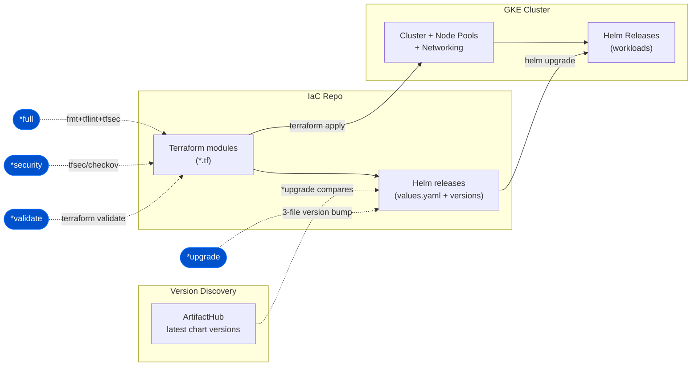

# Horus — IaC Architecture (Terraform + Helm + GKE)

Horus manages infrastructure as code: Terraform provisions GKE and cloud resources,
Helm releases land charts onto the cluster, and chart versions are discovered from
ArtifactHub.

**Pipeline touchpoints:** `*full` runs fmt+lint+security, `*upgrade` bumps Helm chart
versions (atomic 3-file update via ArtifactHub), `*security`/`*validate` gate the
Terraform. See [diagrams-guide.md](../diagrams-guide.md).
