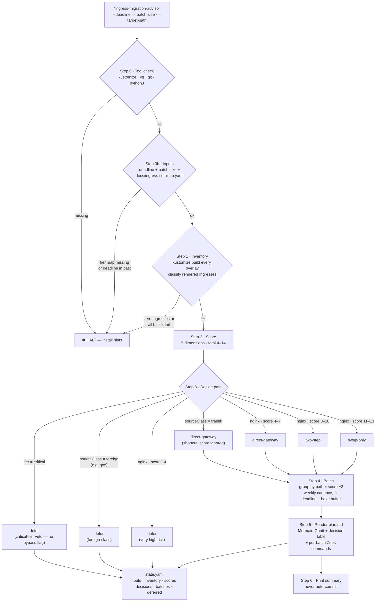

# ingress-migration-advisor — Read-Only EOL Migration Planner

The `*ingress-migration-advisor` Zeus command (skill: `devops:ingress-migration-advisor`, v1.0.0)
inventories every Ingress in a Kustomize repo, scores each service on five migration-readiness
dimensions, and recommends one of four paths per service (direct-gateway, two-step, swap-only,
defer). It sits **upstream** of the three migration skills — it never invokes them and never
mutates the repo. Output is `plan.md` (Mermaid Gantt + per-service table + ready-to-paste Zeus
commands) plus `state.yaml` under `docs/reports/ingress-migration-advisor/<slug>/`.

**Key invariants:**

- **Read-only.** No file mutations, no git operations, no DNS edits; `kustomize build`
  side-effects stay in `/tmp`. Re-running is always safe.
- **Critical-tier veto is policy, not a flag.** There is no `--force-critical` bypass —
  to migrate a critical service, the team PRs `docs/ingress-tier-map.yaml` first.
- **Recommendations, not commands.** The plan suggests copy-paste Zeus commands
  (`*gateway-migrate`, `*nginx-to-gateway`, `*nginx-to-traefik`); the operator runs each
  batch manually. The advisor never invokes the migration skills directly.
- **Plans age.** `--resume` only re-renders the report from existing state; it does NOT
  refresh inventory or scores. Re-run from scratch when the repo shifts.

See [`skills/ingress-migration-advisor/SKILL.md`](../../skills/ingress-migration-advisor/SKILL.md)
and the [HTML drill-down](html/ingress-migration-advisor/diagram.html).
