# nginx-to-gateway — Two-Phase Chain Orchestrator

The `*nginx-to-gateway` Zeus command (skill: `devops:nginx-to-gateway`, v1.0.0) is a
**thin orchestrator** that chains `nginx-to-traefik` (class swap) and
`gateway-api-migration` (resource swap) against one Kustomize module in one operator
session. It owns no conversion logic: each sub-skill keeps its own state file, and the
chain is recorded in `docs/reports/nginx-to-gateway/<slug>/index.yaml` plus a combined
`index.md` linking both sub-reports.

```mermaid
flowchart TD
  A["*nginx-to-gateway &lt;env&gt; --gateway-class traefik | gke-l7-global-external-managed"] --> C0{"C.0 · Tool check<br/>kustomize · yq · git · python3 · kubectl · jq"}
  C0 -- "any tool missing" --> X0["⛔ HALT"]
  C0 -- "ok" --> C1{"C.1 · Chain run-dir<br/>docs/reports/nginx-to-gateway/&lt;slug&gt;/index.yaml"}
  C1 -- "dir exists, no --force" --> X0
  C1 -- "created" --> SKA{"--skip-a?"}
  SKA -- "no" --> C2["C.2 · Phase A — nginx-to-traefik<br/>subroutine · writes own state.yaml + report"]
  SKA -- "yes: validate --phase-a-state<br/>verdict COMPLETE + ≥1 output" --> C3
  C2 -- "A halts" --> XA["phaseA: failed · phaseB: blocked<br/>verdict: FAIL — chain halts, B never invoked"]
  C2 -- "A completes" --> C3{"C.3 · Hand-off<br/>read A's outputs.traefikIngresses&#91;&#93;"}
  C3 -- "empty — zero outputs" --> X0
  C3 -- "copied into index.yaml.phaseA" --> SKB{"--skip-b?"}
  SKB -- "yes" --> XS["phaseB: skipped<br/>verdict: COMPLETED_A_ONLY — clean halt"]
  SKB -- "no" --> C4["C.4 · Phase B — gateway-api-migration<br/>--source-class traefik --no-redirect<br/>--gateway-class &lt;chosen&gt; --source-state &lt;A's state.yaml&gt;"]
  C4 -- "B halts" --> XB["phaseB: failed · verdict: FAIL<br/>resume re-runs C.4 only"]
  C4 -- "B completes" --> C5["C.5 · Render combined index.md<br/>from references/chain-report-template.md"]
  C5 --> V["verdict: PASS<br/>or COMPLETED_WITH_MANUAL_REVIEW on WARN findings"]
```

**Key invariants:**

- The orchestrator **owns no conversion logic** — phase A and phase B do all the work;
  skill C only sequences them and records the chain in `index.yaml`.
- **No state merging** — each sub-skill owns its own state file; C copies only the
  hand-off fields (`outputs.traefikIngresses[]`, cutover status, state/report paths)
  into `index.yaml.phaseA`.
- **No re-validation of A's outputs** — B's classifier reads them fresh via
  `--source-state`.
- No DNS scripts, no cluster apply, no auto-commit.
- Failure semantics: A halts → B is never invoked (`phaseB.status: blocked`);
  B halts after A → A's outputs stay intact, resume runs B only (`--skip-a`);
  C halts after B but before rendering → resume re-runs C.5 only.
- Phase B's report path is recorded verbatim: `docs/reports/gateway-migration/` in
  v1.11.0, `docs/reports/ingress-to-gateway/` after the v2.0.0 rename — no
  special-casing.

See [`skills/nginx-to-gateway/SKILL.md`](../../skills/nginx-to-gateway/SKILL.md)
and the [HTML drill-down](html/nginx-to-gateway/diagram.html).
