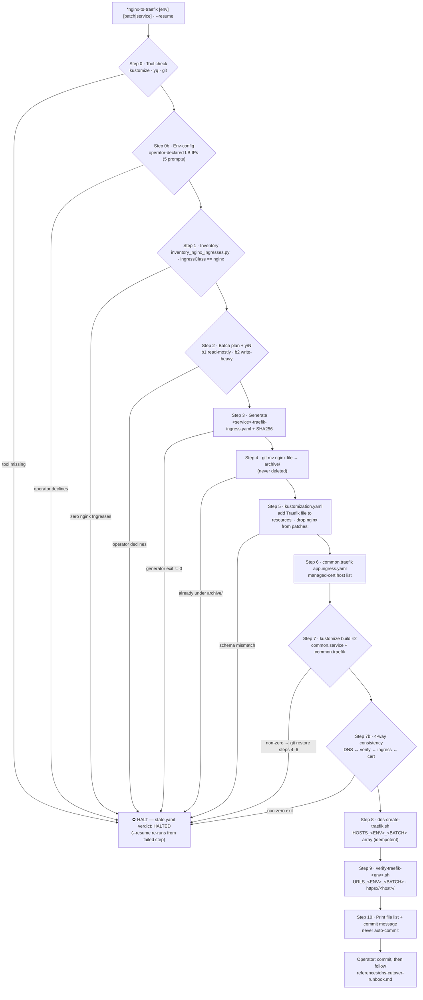

# nginx-to-traefik — Class-Swap Migration to Traefik Ingress

The `*nginx-to-traefik` Zeus command (skill: `devops:nginx-to-traefik`, v1.0.0) ports a
batch of services from NGINX Ingress to Traefik Ingress (`ingressClassName: traefik`)
while **both controllers keep running in parallel** — DNS A-records are the only cutover
lever. It is the first half of the chained NGINX → Traefik → Gateway API migration: its
`state.yaml.outputs.traefikIngresses[]` is the hand-off contract consumed by
`nginx-to-gateway` / `gateway-api-migration --source-class traefik`.

**Key invariants:**

- Traefik Ingresses live in `kustomization.resources` — **never** patches; nginx files
  are `git mv`'d to `archive/` — **never** deleted.
- Backend Service names and `secretName` are written **verbatim** — Kustomize
  `namePrefix` does not touch them.
- LB IPs are **operator-declared only** (spec invariant §5.3) — never derived from any
  cluster resource. DNS A-records are the only cutover lever.
- The skill never auto-commits; state lives in
  `docs/reports/nginx-to-traefik/<slug>/state.yaml` (`<slug>` = `<env>-<batch>-<isodate>`),
  and `outputs.traefikIngresses[]` is the hand-off contract for `nginx-to-gateway`.

See [`skills/nginx-to-traefik/SKILL.md`](../../skills/nginx-to-traefik/SKILL.md) and the
[HTML drill-down](html/nginx-to-traefik/diagram.html).
