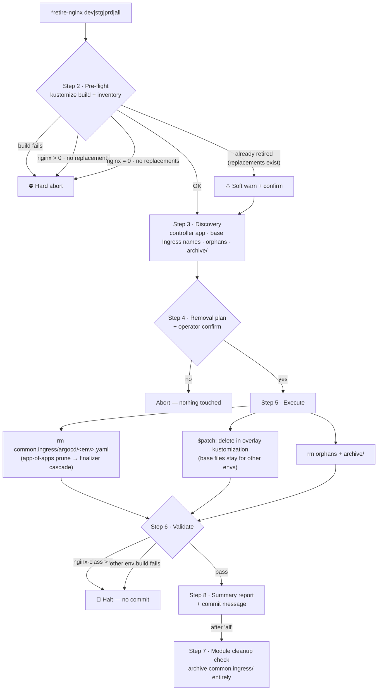

# nginx-ingress-retire — Post-Migration Nginx Retirement

The `*retire-nginx` Zeus command (skill: `devops:nginx-ingress-retire`, v1.17.0) removes
the nginx controller ArgoCD app and excludes base nginx Ingress resources per env —
**after** Gateway API / Traefik migration is complete. Safety-gated: it refuses to run
when no replacement routing (HTTPRoute / Traefik Ingress) exists.

**Key invariants:**

- Validates `ingress.class: nginx` count = 0, **not** total `kind: Ingress` count —
  Traefik Ingresses legitimately remain.
- `$patch: delete` targets the **un-prefixed** resource name (Kustomize applies
  patches before `namePrefix`).
- Class-override patches (e.g. `ingress.class: gce`) are detected via rendered-manifest
  cross-check and **never** deleted — only the file is renamed, never `metadata.name`
  (renaming the resource would reprovision the cloud LB).

See [`skills/nginx-ingress-retire/SKILL.md`](../../skills/nginx-ingress-retire/SKILL.md),
the [HTML drill-down](html/retire-nginx/diagram.html), and the
[mindmap explainer](html/retire-nginx/mindmap.html).
