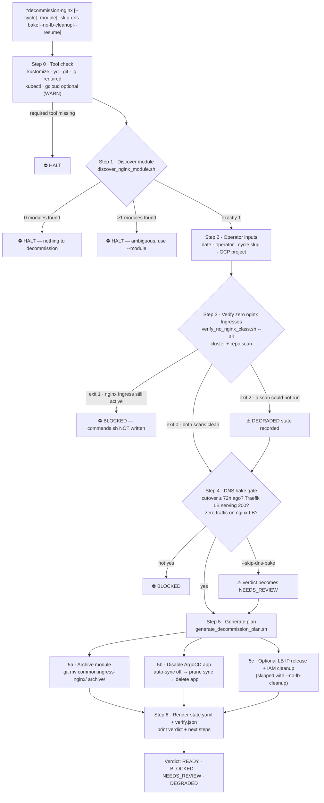

# traefik-controller-decommission — GitOps-Safe ingress-nginx Uninstall Planner

The `*decommission-nginx` Zeus command (skill: `devops:traefik-controller-decommission`) plans
the SAFE removal of the `ingress-nginx` controller in a Kustomize + ArgoCD repo. It verifies
cluster and repo are free of `ingressClassName: nginx` (precedence-aware: spec wins, legacy
annotation falls back), gates on a 72h DNS bake confirmation, then emits a **plan-only**
`commands.sh` — archive the module, disable the ArgoCD Application, wait for prune, optional
LB/IAM cleanup. It never runs `helm uninstall`; ArgoCD prunes the actual resources.

**Key invariants:**

- **Never runs `helm uninstall` or `kubectl delete` directly** — ArgoCD prunes the
  controller's resources once the Application is disabled and the module is archived.
- **Plan-only output**: `commands.sh` is copy-paste-ready and NEVER auto-executed;
  the operator drives it block-by-block.
- **Precedence-aware nginx detection**: an Ingress counts as nginx when
  `spec.ingressClassName == "nginx"`, OR the spec field is null AND the legacy
  `kubernetes.io/ingress.class: nginx` annotation is present — spec always wins.
- **Touches only the ingress-nginx module** (`common.ingress-nginx/` or equivalent)
  plus its ArgoCD Application manifest; full-file backups before any edit.
- BLOCKED at Step 3 means `commands.sh` is not written at all — the operator must
  re-migrate or delete the stale nginx Ingress first.

See [`skills/traefik-controller-decommission/SKILL.md`](../../skills/traefik-controller-decommission/SKILL.md)
and the [HTML drill-down](html/traefik-controller-decommission/diagram.html).
