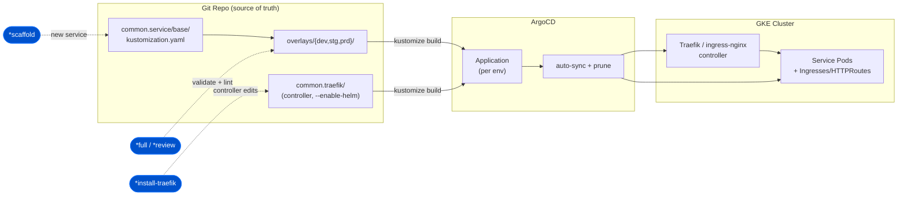

# Zeus — GitOps Architecture (Kustomize + ArgoCD)

Zeus operates a GitOps repo where Kustomize renders per-environment manifests and
ArgoCD continuously syncs them to GKE. The ingress layer is split into a **controller
plane** (`common.traefik/`) and a **data plane** (`common.service/`).

**Pipeline touchpoints:** `*full`/`*review` validate overlays, `*scaffold` adds a new
service to `base/`, `*install-traefik` edits the controller plane. See
[diagrams-guide.md](../diagrams-guide.md).
