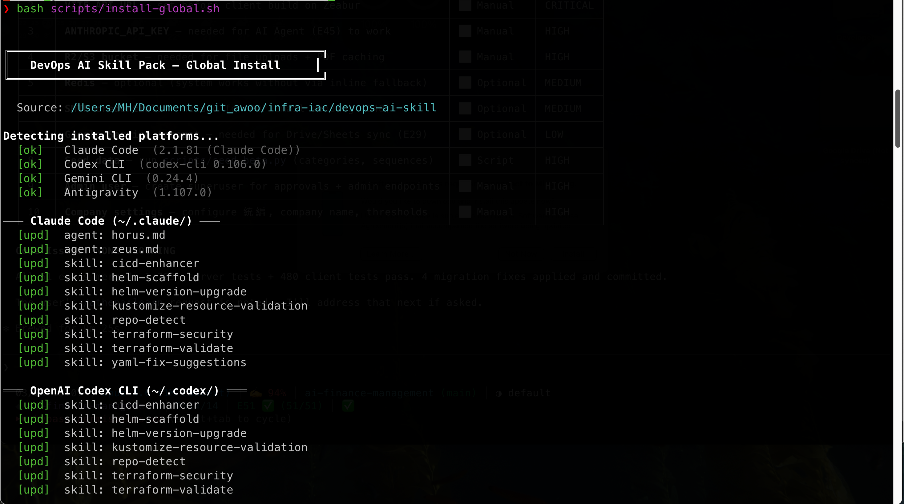
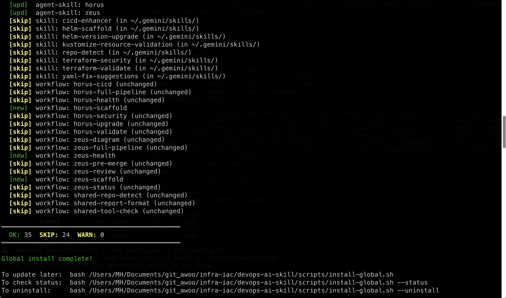
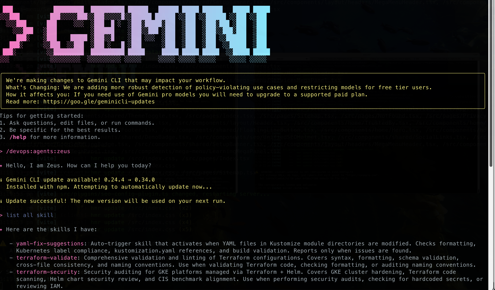
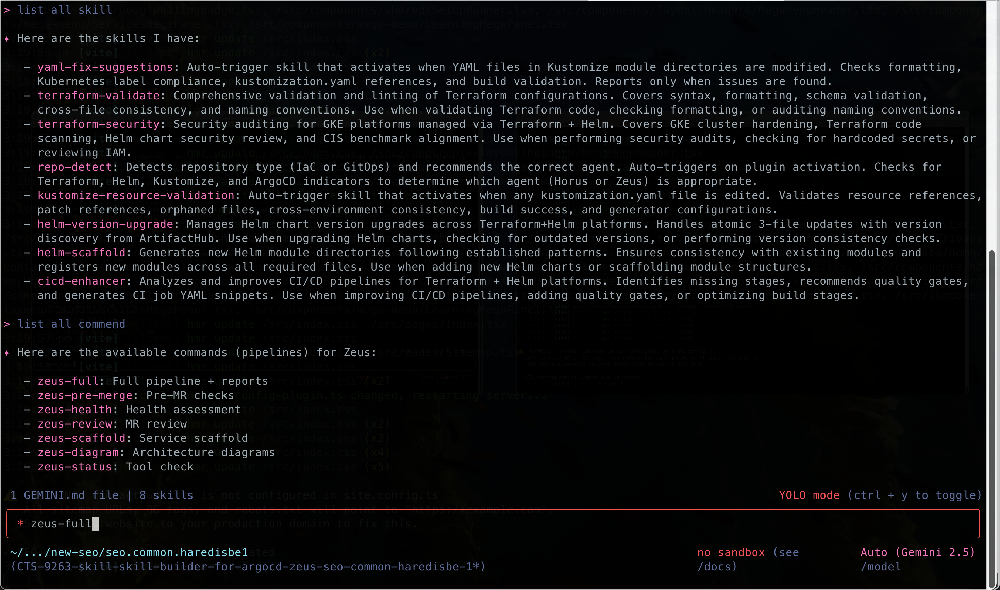
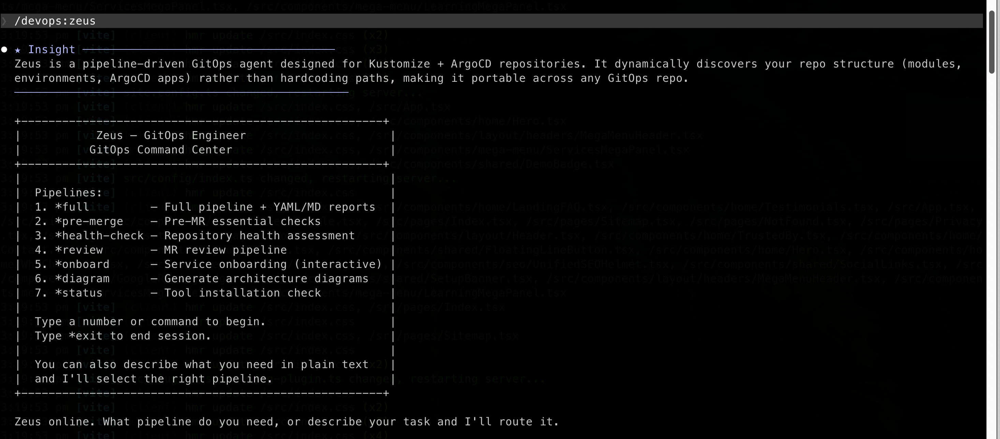
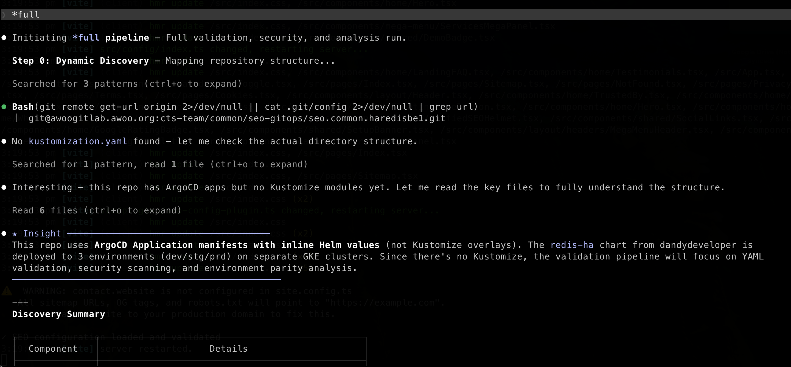
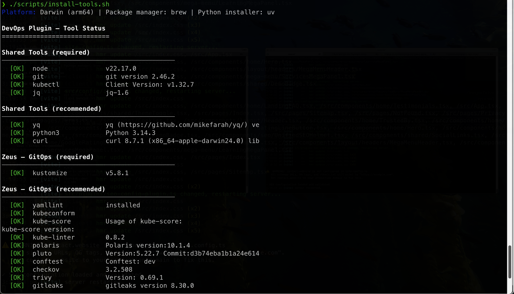
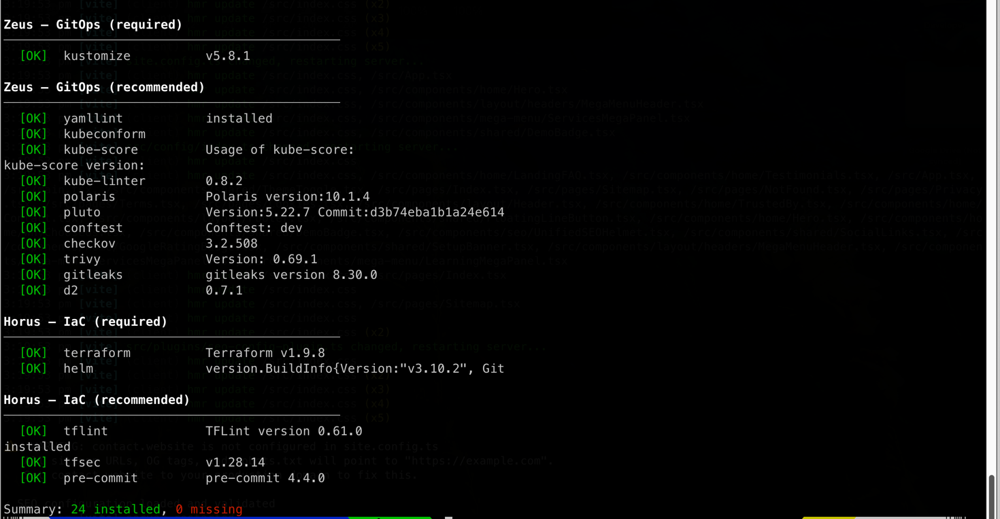
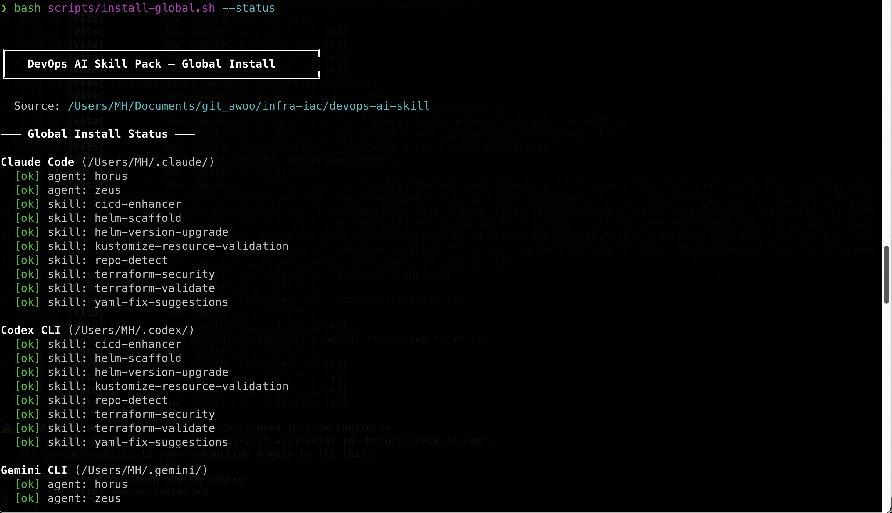

# 5-Minute Quick Start — DevOps AI Skill Pack

> Zero to AI-powered DevOps in 5 minutes!

English | [繁體中文](quick-start.zh-TW.md) | [简体中文](quick-start.zh-CN.md)

---

## Prerequisites

You only need:

- **Git**
- **One AI CLI tool** (pick any):
  - [Claude Code](https://docs.anthropic.com/en/docs/claude-code/overview) — `npm install -g @anthropic-ai/claude-code`
  - [Google Gemini CLI](https://github.com/google-gemini/gemini-cli) — `npm install -g @anthropic-ai/gemini-cli`
  - [OpenAI Codex CLI](https://github.com/openai/codex) — `npm install -g @openai/codex`
  - [Google Antigravity](https://developers.google.com/antigravity) — Built into IDE

> No need to install Terraform, Helm, etc. first! The agent will prompt you when needed.

## Step 1: Install the Skill Pack (1 min)

**macOS / Linux:**

```bash
git clone https://github.com/qwedsazxc78/devops-ai-skill.git
cd devops-ai-skill
bash scripts/install-global.sh
```

**Windows (one-click):**

```powershell
git clone https://github.com/qwedsazxc78/devops-ai-skill.git
cd devops-ai-skill
.\scripts\setup\install.bat        # Interactive menu — choose [1] Skills
```

Done when you see `Global install complete!`




## Step 2: Launch the Agent (30 sec)

```bash
cd ~/your-project        # Your Terraform/Kustomize project
claude                   # Claude Code
# gemini                 # Google Gemini CLI
# codex                  # OpenAI Codex CLI
# antigravity            # Google Antigravity (use within IDE)
```

The agent auto-detects your project type:
- Has `*.tf` files → **Horus** (IaC expert) activates
- Has `kustomization.yaml` → **Zeus** (GitOps expert) activates

**Gemini CLI example** — skills and commands are auto-discovered:




**Zeus agent activation** — the agent introduces itself and lists available pipelines:



## Step 3: Run Your First Command (1 min)

### Scenario A: Terraform + Helm (Horus)

```
> *health
```

Horus scans your project and generates a health report:
- Which tools are installed / missing
- Project structure validation
- Common configuration issues

### Scenario B: Kustomize + ArgoCD (Zeus)

```
> *health
```

Zeus checks your GitOps repository:
- Kustomize overlay correctness
- YAML format compliance
- Orphaned resource detection



## Step 4: Try More Commands (2 min)

### Command Quick Reference

| Goal | Horus | Zeus |
|------|-------|------|
| Full check | `*full` | `*full` |
| Security scan | `*security` | `*full` (includes security) |
| Validate format | `*validate` | `*pre-merge` |
| Upgrade versions | `*upgrade` | — |
| Scaffold new module | `*scaffold` | `*scaffold` |
| Architecture diagram | — | `*diagram` |
| Tool check | `*health` | `*status` |

### Examples

```
> *validate
# → Horus runs terraform fmt + validate + tflint, generates report

> *security
# → Horus analyzes your .tf files for security risks

> *upgrade
# → Horus queries ArtifactHub, lists upgradable Helm Charts
```

### Scenario: Migrate from NGINX Ingress to GKE Gateway API (Zeus)

If your GitOps repo uses NGINX Ingress and you want to move to GKE Gateway API:

```
> *gateway-migrate
```

Zeus will detect your Ingress topology (master/minion or standalone), classify each annotation against the [annotation map](../docs/gateway/annotation-map.md), and generate:

- A new `common.gateway/` Kustomize module with the Gateway resource
- HTTPRoute resources alongside your existing minions (side-by-side, no overwrites)
- A state YAML + migration report under `docs/reports/gateway-migration/`
- A per-hostname DNS cutover runbook

Old NGINX Ingress stack stays untouched — both run in parallel, you flip DNS one hostname at a time. Full reference: [docs/gateway/](../docs/gateway/).

## Step 5: Install DevOps Tools (optional)

The agent tells you which tools are missing during execution. You can also install them all at once:




**macOS / Linux:**

```bash
# Interactive: confirm each install
./scripts/install-tools.sh

# One-click install for your agent
./scripts/install-tools.sh install horus   # Terraform + Helm tools
./scripts/install-tools.sh install zeus    # Kustomize + GitOps tools
```

**Windows:**

> No admin / UAC needed for most tools — `winget` / `scoop` / `uv` install per-user. Only `choco` packages need an elevated shell.

```powershell
powershell -ExecutionPolicy Bypass -File scripts\install-tools.ps1
powershell -ExecutionPolicy Bypass -File scripts\install-tools.ps1 install horus
powershell -ExecutionPolicy Bypass -File scripts\install-tools.ps1 install zeus
```

> Running `.ps1` files directly can fail under the default `Restricted` execution policy (*"running scripts is disabled on this system"*). The `-ExecutionPolicy Bypass` form above — and `scripts\setup\install.bat` — sidestep this for that one run, no admin/UAC needed.

## FAQ

### Q: No Terraform project to test with?

Create a minimal project:

```bash
mkdir demo-iac && cd demo-iac
cat > main.tf << 'EOF'
terraform {
  required_version = ">= 1.0"
}

resource "null_resource" "demo" {}
EOF
claude    # Start agent (or gemini/codex), type *health
```

### Q: Windows?

Native PowerShell install — no Git Bash, no WSL:

```powershell
# One-click (interactive menu)
.\scripts\setup\install.bat

# Or non-interactive (per-user, no admin needed)
powershell -ExecutionPolicy Bypass -File scripts\install-global.ps1
powershell -ExecutionPolicy Bypass -File scripts\install-tools.ps1 install
```

Targets PowerShell 5.1, which ships built-in on every Windows 10 / 11 / Server 2016+ box. If you do prefer bash on Windows, Git Bash and WSL still work with the `.sh` scripts:

```bash
# Git Bash
bash scripts/install-global.sh

# WSL
wsl bash scripts/install-global.sh
```

### Q: Nothing happens after install?

Check install status:

```bash
bash scripts/install-global.sh --status
```



### Q: Can I use multiple platforms at once?

Yes! Global install auto-detects all installed AI CLIs and configures them all.

## Next Steps

- 📖 [Full Setup Guide](setup.md) — Advanced install options
- 🌐 [GitHub Repo](https://github.com/qwedsazxc78/devops-ai-skill) — Star us!
- 📂 [docs/guide/](guide/) — Tutorial screenshots
