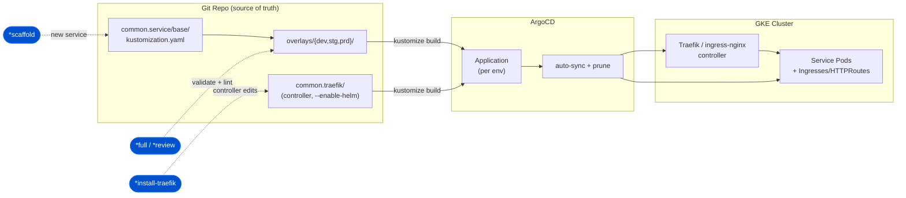
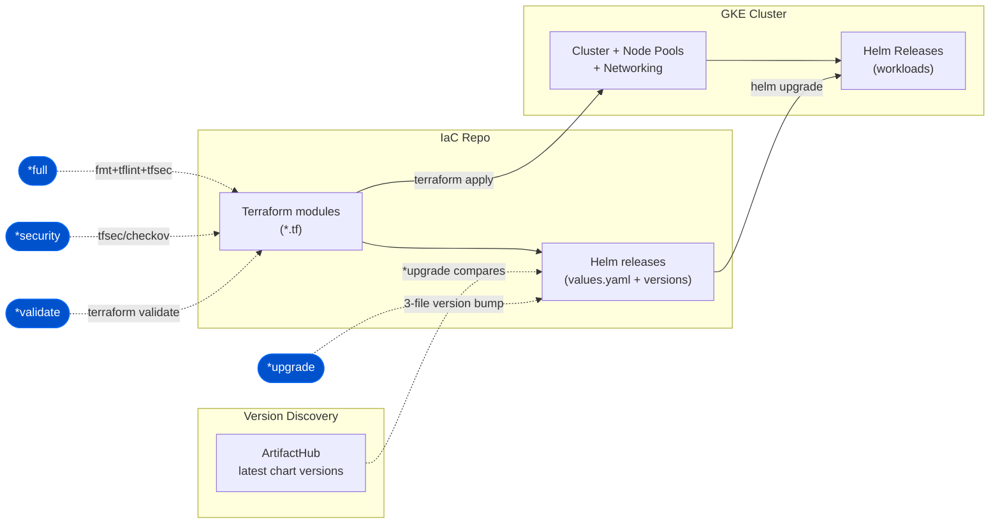
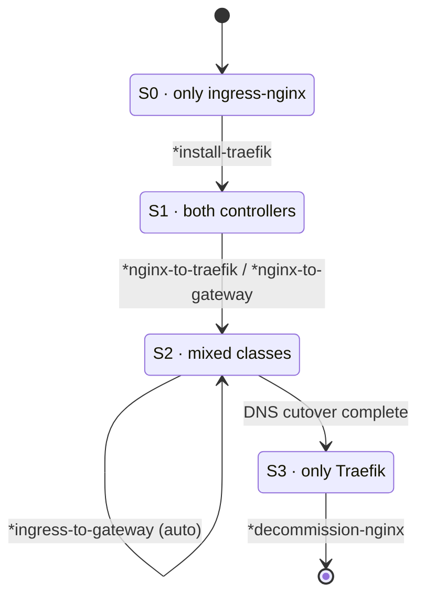
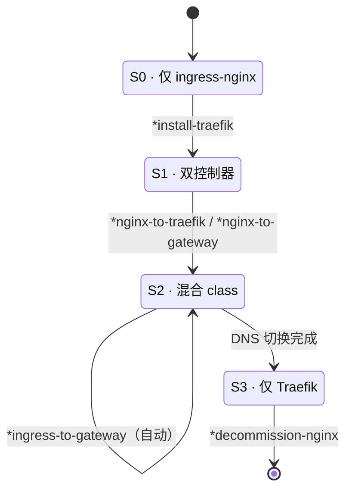

# Diagram Capability Enhancement — Implementation Plan

> **For agentic workers:** REQUIRED SUB-SKILL: Use superpowers:subagent-driven-development (recommended) or superpowers:executing-plans to implement this plan task-by-task. Steps use checkbox (`- [ ]`) syntax for tracking.

**Goal:** Wire the `*diagram` pipeline to the `painter` skill and ship 3 sample architecture diagrams (Zeus / Horus / Migration) in both Mermaid and detailed Painter-HTML, with docs gallery, usage guide, README integration, and updated GitHub metadata.

**Architecture:** `prompts/zeus/diagram.md` becomes a thin recipe layer that delegates rendering to `devops:painter`. Mermaid artifacts (render inline on GitHub) live in `docs/diagrams/*.md`; detailed Painter-HTML (overview + drill-down) lives in `docs/diagrams/html/<name>/`. Docs and READMEs surface the gallery.

**Tech Stack:** Markdown + Mermaid (`flowchart`, `stateDiagram-v2`), HTML/CSS/SVG via the `painter` skill, `gh repo edit` for metadata, `pnpm test` (bash structure tests) for verification.

**Spec:** `docs/superpowers/specs/2026-06-01-diagram-enhancement-design.md`

**Important conventions discovered:**
- The ASCII migration journey block is **only** in `README.md` (L290–310); localized READMEs (`docs/README.zh-TW.md`, `docs/README.zh-CN.md`) do **not** contain it — they get a *new* section, no block to replace.
- Skills section anchor: `README.md` L315 `## Skills`; zh-TW L279 `## 技能模組`; zh-CN L279 `## 技能模块`.
- Horus pipelines: `full-pipeline, upgrade, security, validate, scaffold, cicd, health`.
- No `prompts/zeus/painter.md` exists — painter is a skill, invoked by the recipe.

---

### Task 1: Zeus GitOps Mermaid diagram

**Files:**
- Create: `docs/diagrams/zeus-gitops.md`

- [ ] **Step 1: Write the Mermaid file**

```markdown
# Zeus — GitOps Architecture (Kustomize + ArgoCD)

Zeus operates a GitOps repo where Kustomize renders per-environment manifests and
ArgoCD continuously syncs them to GKE. The ingress layer is split into a **controller
plane** (`common.traefik/`) and a **data plane** (`common.service/`).



**Pipeline touchpoints:** `*full`/`*review` validate overlays, `*scaffold` adds a new
service to `base/`, `*install-traefik` edits the controller plane. See
[diagrams-guide.md](../diagrams-guide.md).
```
(Note: the outer ```` ``` ```` fences in this step wrap the file content; the inner
`mermaid` block is the actual diagram. Write the file so the `mermaid` fence is a
top-level fence in the `.md`.)

- [ ] **Step 2: Verify Mermaid parses**

Run: `node -e "const fs=require('fs');const m=fs.readFileSync('docs/diagrams/zeus-gitops.md','utf8').match(/\`\`\`mermaid([\s\S]*?)\`\`\`/);console.log(m?'mermaid block found, '+m[1].length+' chars':'NO MERMAID BLOCK')"`
Expected: `mermaid block found, NNN chars`

- [ ] **Step 3: Commit**

```bash
git add docs/diagrams/zeus-gitops.md
git commit -m "docs(diagrams): add Zeus GitOps mermaid diagram"
```

---

### Task 2: Horus IaC Mermaid diagram

**Files:**
- Create: `docs/diagrams/horus-iac.md`

- [ ] **Step 1: Write the Mermaid file**

```markdown
# Horus — IaC Architecture (Terraform + Helm + GKE)

Horus manages infrastructure as code: Terraform provisions GKE and cloud resources,
Helm releases land charts onto the cluster, and chart versions are discovered from
ArtifactHub.



**Pipeline touchpoints:** `*full` runs fmt+lint+security, `*upgrade` bumps Helm chart
versions (atomic 3-file update via ArtifactHub), `*security`/`*validate` gate the
Terraform. See [diagrams-guide.md](../diagrams-guide.md).
```

- [ ] **Step 2: Verify Mermaid parses**

Run: `node -e "const fs=require('fs');const m=fs.readFileSync('docs/diagrams/horus-iac.md','utf8').match(/\`\`\`mermaid([\s\S]*?)\`\`\`/);console.log(m?'OK '+m[1].length:'NO MERMAID')"`
Expected: `OK NNN`

- [ ] **Step 3: Commit**

```bash
git add docs/diagrams/horus-iac.md
git commit -m "docs(diagrams): add Horus IaC mermaid diagram"
```

---

### Task 3: Migration journey Mermaid diagram

**Files:**
- Create: `docs/diagrams/migration-journey.md`

- [ ] **Step 1: Write the Mermaid file** (mirrors README ASCII block L290–310, 7 commands)

```markdown
# Migration Journey — ingress-nginx → Traefik → Gateway API

The Zeus migration commands move a cluster through four states. ingress-nginx EOL
(2025) is the forcing function; the journey is gradual and DNS-reversible.

```mermaid
stateDiagram-v2
  [*] --> S0
  S0: S0 · only ingress-nginx
  S1: S1 · both controllers
  S2: S2 · mixed classes
  S3: S3 · only Traefik

  S0 --> S1: *install-traefik
  S1 --> S1: *ingress-migration-advisor<br/>(whole-repo plan)
  S1 --> S2: *nginx-to-traefik &lt;env&gt;<br/>(class swap)
  S1 --> S2: *nginx-to-gateway &lt;env&gt;<br/>(full chain)
  S2 --> S2: *ingress-to-gateway &lt;module&gt;<br/>(auto-detect source)
  S2 --> S3: (DNS cutover complete)
  S3 --> [*]: *decommission-nginx
```

**7 commands:** `*install-traefik`, `*ingress-migration-advisor`, `*nginx-to-traefik`,
`*nginx-to-gateway`, `*ingress-to-gateway`, `*decommission-nginx`, plus
`*migration-quickstart` for orientation. See [diagrams-guide.md](../diagrams-guide.md).
```

- [ ] **Step 2: Verify Mermaid parses + command count**

Run: `node -e "const fs=require('fs');const s=fs.readFileSync('docs/diagrams/migration-journey.md','utf8');const m=s.match(/\`\`\`mermaid([\s\S]*?)\`\`\`/);const cmds=(s.match(/\*[a-z-]+/g)||[]).length;console.log(m?'OK mermaid, cmd-refs='+cmds:'NO MERMAID')"`
Expected: `OK mermaid, cmd-refs=` ≥ 6

- [ ] **Step 3: Commit**

```bash
git add docs/diagrams/migration-journey.md
git commit -m "docs(diagrams): add migration journey state diagram"
```

---

### Task 4: Painter HTML (detailed) — Zeus

Delegate rendering to the `painter` skill. Do NOT hand-write HTML — invoke the skill so
the blue-white style rules, card UI, SVG arrows, dark code blocks, and back-links are
applied consistently.

**Files:**
- Create: `docs/diagrams/html/zeus/diagram.html` (overview, cards are clickable links)
- Create: `docs/diagrams/html/zeus/diagrams/kustomize.html`
- Create: `docs/diagrams/html/zeus/diagrams/argocd.html`
- Create: `docs/diagrams/html/zeus/diagrams/common-traefik.html`
- Create: `docs/diagrams/html/zeus/diagrams/common-service.html`

- [ ] **Step 1: Invoke painter with the Zeus component inventory**

Invoke `devops:painter` (Skill tool, or an Agent running it) with:
- `--level detailed --output docs/diagrams/html/zeus`
- Title: "Zeus — GitOps Architecture (Kustomize + ArgoCD)"
- Overview cards (each links to its detail page), in flow order:
  1. **kustomize** (slug `kustomize`) — base/ + overlays/{dev,stg,prd}; purpose: render
     per-env manifests; show a `kustomization.yaml` resources snippet.
  2. **argocd** (slug `argocd`) — Application per env, auto-sync + prune; show an
     ArgoCD `Application` spec snippet (repoURL, path, syncPolicy.automated).
  3. **common-traefik** (slug `common-traefik`) — controller plane, needs
     `--enable-helm`; show the `*install-traefik` touchpoint + a Traefik values snippet.
  4. **common-service** (slug `common-service`) — data plane, Ingresses/HTTPRoutes per
     service; show a minion Ingress snippet.
- Flow arrows: kustomize → argocd → (common-traefik, common-service) → GKE.
- Bottom checklist: "kustomize build green / ArgoCD synced / controller healthy /
  routes Accepted=True".
- Each detail page: purpose, key config (dark code block), dependencies, Zeus pipeline
  touchpoints, `← Back to overview` (href `../diagram.html`), relative paths only.

- [ ] **Step 2: Verify files + relative links resolve**

Run:
```bash
test -f docs/diagrams/html/zeus/diagram.html && \
for s in kustomize argocd common-traefik common-service; do test -f docs/diagrams/html/zeus/diagrams/$s.html || echo "MISSING $s"; done && \
grep -q 'diagrams/kustomize.html' docs/diagrams/html/zeus/diagram.html && \
grep -q '../diagram.html' docs/diagrams/html/zeus/diagrams/argocd.html && \
echo "ZEUS HTML OK"
```
Expected: `ZEUS HTML OK` (no MISSING lines)

- [ ] **Step 3: Commit**

```bash
git add docs/diagrams/html/zeus
git commit -m "docs(diagrams): add detailed Zeus painter HTML (overview + 4 drill-downs)"
```

---

### Task 5: Painter HTML (detailed) — Horus

**Files:**
- Create: `docs/diagrams/html/horus/diagram.html`
- Create: `docs/diagrams/html/horus/diagrams/terraform.html`
- Create: `docs/diagrams/html/horus/diagrams/helm.html`
- Create: `docs/diagrams/html/horus/diagrams/gke.html`
- Create: `docs/diagrams/html/horus/diagrams/artifacthub.html`

- [ ] **Step 1: Invoke painter with the Horus component inventory**

Invoke `devops:painter` with `--level detailed --output docs/diagrams/html/horus`,
title "Horus — IaC Architecture (Terraform + Helm + GKE)". Overview cards (clickable):
  1. **terraform** (`terraform`) — modules provision GKE + networking; `*validate`/
     `*security` touchpoints; show a `module` block snippet.
  2. **helm** (`helm`) — releases + pinned chart versions; `*upgrade` atomic 3-file
     bump; show a `values.yaml` version pin snippet.
  3. **gke** (`gke`) — cluster, node pools, workloads; show `terraform apply` + cluster
     outputs.
  4. **artifacthub** (`artifacthub`) — upstream chart version source; show how
     `*upgrade` compares pinned vs latest.
Flow arrows: terraform → helm → gke; artifacthub -.-> helm. Bottom checklist:
"terraform validate / tfsec clean / chart versions current / releases healthy". Detail
pages follow the same rules as Task 4 (dark code blocks, `← Back to overview`).

- [ ] **Step 2: Verify files + links**

Run:
```bash
test -f docs/diagrams/html/horus/diagram.html && \
for s in terraform helm gke artifacthub; do test -f docs/diagrams/html/horus/diagrams/$s.html || echo "MISSING $s"; done && \
grep -q 'diagrams/terraform.html' docs/diagrams/html/horus/diagram.html && \
grep -q '../diagram.html' docs/diagrams/html/horus/diagrams/helm.html && \
echo "HORUS HTML OK"
```
Expected: `HORUS HTML OK`

- [ ] **Step 3: Commit**

```bash
git add docs/diagrams/html/horus
git commit -m "docs(diagrams): add detailed Horus painter HTML (overview + 4 drill-downs)"
```

---

### Task 6: Painter HTML (detailed) — Migration

**Files:**
- Create: `docs/diagrams/html/migration/diagram.html`
- Create: `docs/diagrams/html/migration/diagrams/install-traefik.html`
- Create: `docs/diagrams/html/migration/diagrams/nginx-to-traefik.html`
- Create: `docs/diagrams/html/migration/diagrams/gateway-migrate.html`
- Create: `docs/diagrams/html/migration/diagrams/decommission-nginx.html`

- [ ] **Step 1: Invoke painter with the Migration journey inventory**

Invoke `devops:painter` with `--level detailed --output docs/diagrams/html/migration`,
title "Migration Journey — ingress-nginx → Traefik → Gateway API". Overview is the
S0→S1→S2→S3 card flow (one card per state, with the command on the arrow). Clickable
detail cards, one per key command:
  1. **install-traefik** (`install-traefik`) — S0→S1, edits `common.traefik/`; show the
     `*install-traefik` invocation + Kustomize controller snippet.
  2. **nginx-to-traefik** (`nginx-to-traefik`) — S1→S2 class swap, parallel run, DNS
     cutover; show before/after `ingressClassName`.
  3. **gateway-migrate** (`gateway-migrate`) — Ingress → Gateway API (Gateway +
     HTTPRoute); show a master→Gateway + minion→HTTPRoute before/after snippet.
  4. **decommission-nginx** (`decommission-nginx`) — S3 cleanup, archive module +
     ArgoCD prune (never `helm uninstall`); show the safety preconditions.
Bottom checklist: "Traefik installed / classes swapped / Gateway routes Accepted /
nginx decommissioned". Same style rules + `← Back to overview`.

- [ ] **Step 2: Verify files + links**

Run:
```bash
test -f docs/diagrams/html/migration/diagram.html && \
for s in install-traefik nginx-to-traefik gateway-migrate decommission-nginx; do test -f docs/diagrams/html/migration/diagrams/$s.html || echo "MISSING $s"; done && \
grep -q 'diagrams/install-traefik.html' docs/diagrams/html/migration/diagram.html && \
grep -q '../diagram.html' docs/diagrams/html/migration/diagrams/gateway-migrate.html && \
echo "MIGRATION HTML OK"
```
Expected: `MIGRATION HTML OK`

- [ ] **Step 3: Commit**

```bash
git add docs/diagrams/html/migration
git commit -m "docs(diagrams): add detailed migration journey painter HTML"
```

---

### Task 7: Gallery index `docs/diagrams/README.md`

**Files:**
- Create: `docs/diagrams/README.md`

- [ ] **Step 1: Write the gallery (embeds Mermaid inline, links HTML overviews)**

```markdown
# Architecture Diagram Gallery

Generated by the Zeus `*diagram` pipeline (engine: [`devops:painter`](../../skills/painter/SKILL.md)).
Each diagram ships in two formats: **Mermaid** (renders inline below / on GitHub) and a
**detailed Painter-HTML** (open in a browser for a polished, drill-down view + screenshots).

See [diagrams-guide.md](../diagrams-guide.md) for how to regenerate these.

## Zeus — GitOps (Kustomize + ArgoCD)

- Mermaid: [`zeus-gitops.md`](zeus-gitops.md)
- HTML (detailed): [`html/zeus/diagram.html`](html/zeus/diagram.html)

> Open `html/zeus/diagram.html` in a browser; click any card to drill into a component.

## Horus — IaC (Terraform + Helm + GKE)

- Mermaid: [`horus-iac.md`](horus-iac.md)
- HTML (detailed): [`html/horus/diagram.html`](html/horus/diagram.html)

## Migration — ingress-nginx → Traefik → Gateway API

- Mermaid: [`migration-journey.md`](migration-journey.md)
- HTML (detailed): [`html/migration/diagram.html`](html/migration/diagram.html)

---

## Formats at a glance

| Format | Renders on GitHub? | Best for |
|--------|:--:|----------|
| Mermaid (`.md`) | ✅ | README, inline docs, version control |
| Painter HTML (`html/<name>/`) | ❌ (open locally) | slides, screenshots, drill-down detail |
```

- [ ] **Step 2: Verify every linked target exists**

Run:
```bash
cd docs/diagrams && for f in zeus-gitops.md horus-iac.md migration-journey.md html/zeus/diagram.html html/horus/diagram.html html/migration/diagram.html; do test -f "$f" || echo "BROKEN LINK $f"; done; echo "gallery link check done"; cd ../..
```
Expected: `gallery link check done` with no `BROKEN LINK` lines

- [ ] **Step 3: Commit**

```bash
git add docs/diagrams/README.md
git commit -m "docs(diagrams): add gallery index"
```

---

### Task 8: Usage guide `docs/diagrams-guide.md`

**Files:**
- Create: `docs/diagrams-guide.md`

- [ ] **Step 1: Write the usage doc**

```markdown
# Diagram Guide — `*diagram` & the Painter skill

The Zeus `*diagram` pipeline turns a repo's architecture into visuals. It is a thin
**recipe layer** over the [`devops:painter`](../skills/painter/SKILL.md) skill, which is
the rendering engine.

## `*diagram` vs `devops:painter`

| Use | When |
|-----|------|
| `*diagram` | You want a ready-made recipe (Zeus / Horus / Migration) with sensible defaults and output paths. |
| `devops:painter` directly | You want full control over components, level, and output for any custom diagram. |

## Parameters (passed through to painter)

| Param | Values | Default | Meaning |
|-------|--------|---------|---------|
| `--level` | `basic` \| `detailed` | `basic` | `detailed` = overview + clickable per-component drill-down pages |
| `--output` | path | `docs/diagrams/html/<name>` | output directory |
| `--parallel` | `auto` \| `off` \| N | `auto` | multi-agent scan; auto-on when components ≥ 5 |

## Recipes

### Zeus (GitOps)
Maps `common.service/base + overlays` → ArgoCD `Application` → GKE, plus the
`common.traefik` controller / `common.service` data-plane split.
- Mermaid: [`diagrams/zeus-gitops.md`](diagrams/zeus-gitops.md)
- HTML: [`diagrams/html/zeus/diagram.html`](diagrams/html/zeus/diagram.html)

### Horus (IaC)
Maps Terraform modules + Helm releases → ArtifactHub version discovery → GKE.
- Mermaid: [`diagrams/horus-iac.md`](diagrams/horus-iac.md)
- HTML: [`diagrams/html/horus/diagram.html`](diagrams/html/horus/diagram.html)

### Migration
The S0→S3 ingress-nginx → Traefik → Gateway API state journey (7 commands).
- Mermaid: [`diagrams/migration-journey.md`](diagrams/migration-journey.md)
- HTML: [`diagrams/html/migration/diagram.html`](diagrams/html/migration/diagram.html)

## Dual-format output

| Format | Path | Renders on GitHub | Use |
|--------|------|:--:|-----|
| Mermaid | `docs/diagrams/<name>.md` | ✅ | README, inline docs |
| Painter HTML | `docs/diagrams/html/<name>/` | ❌ | slides, screenshots, drill-down |

## Regenerate

```text
# Inside Zeus
*diagram                       # interactive: pick recipe + level
# Or call the skill directly
devops:painter --level detailed --output docs/diagrams/html/zeus
```

Optional tools improve fidelity: `d2` (`brew install d2`). Without them painter still
produces HTML — graceful degradation.

See the [gallery](diagrams/README.md) for all rendered samples.
```

- [ ] **Step 2: Verify internal links resolve**

Run:
```bash
for f in skills/painter/SKILL.md docs/diagrams/zeus-gitops.md docs/diagrams/horus-iac.md docs/diagrams/migration-journey.md docs/diagrams/README.md docs/diagrams/html/zeus/diagram.html; do test -f "$f" || echo "BROKEN $f"; done; echo "guide link check done"
```
Expected: `guide link check done` with no `BROKEN` lines

- [ ] **Step 3: Commit**

```bash
git add docs/diagrams-guide.md
git commit -m "docs(diagrams): add diagrams-guide usage doc"
```

---

### Task 9: Enhance `prompts/zeus/diagram.md`

**Files:**
- Modify (full rewrite): `prompts/zeus/diagram.md`

- [ ] **Step 1: Replace the file contents**

```markdown
# Generate Architecture Diagrams

Generate visual architecture documentation. This pipeline is a **thin recipe layer**
over the `devops:painter` skill (the rendering engine). See
[`docs/diagrams-guide.md`](../../docs/diagrams-guide.md) and the
[gallery](../../docs/diagrams/README.md).

## Step 0: Delegate to the painter skill

The painter skill owns rendering (blue-white style, card UI, SVG arrows, dark code
blocks, `basic|detailed` drill-down, multi-agent parallel scanning). This pipeline
supplies the **recipe** (which components, which flow) and the **output contract**.

Parameters passed through to painter:

| Param | Values | Default |
|-------|--------|---------|
| `--level` | `basic` \| `detailed` | `basic` |
| `--output` | path | `docs/diagrams/html/<name>` |
| `--parallel` | `auto` \| `off` \| N | `auto` |

If the user does not pick a recipe, ask which one (Zeus / Horus / Migration) and
whether they want `basic` or `detailed`.

## Step 1: Detect repository type & parse structure

- Run `prompts/shared/repo-detect.md` to detect IaC vs GitOps.
- Discover modules, overlays, ArgoCD apps (GitOps) or Terraform modules + Helm releases
  (IaC). Map dependencies.

## Step 2: Pick a recipe

### Zeus (GitOps) — `--output docs/diagrams/html/zeus`
`common.service/base + overlays/{dev,stg,prd}` → ArgoCD `Application` → GKE, plus the
`common.traefik` controller / `common.service` data-plane split. Components:
kustomize, argocd, common-traefik, common-service.

### Horus (IaC) — `--output docs/diagrams/html/horus`
Terraform modules + Helm releases → ArtifactHub version discovery → GKE. Components:
terraform, helm, gke, artifacthub.

### Migration — `--output docs/diagrams/html/migration`
S0→S1→S2→S3 ingress-nginx → Traefik → Gateway API journey (7 commands). Components:
install-traefik, nginx-to-traefik, gateway-migrate, decommission-nginx.

## Step 3: Render (dual format)

- **Mermaid** → `docs/diagrams/<name>.md` (`flowchart` for Zeus/Horus,
  `stateDiagram-v2` for Migration). Renders inline on GitHub.
- **Painter HTML** → `docs/diagrams/html/<name>/diagram.html` (+ `diagrams/<slug>.html`
  drill-downs when `--level detailed`). Invoke `devops:painter` with the recipe's
  component inventory.
- Workflow flowcharts (optional): CI/CD, deployment, sync/reconciliation flow.

## Step 4: Output & index

- Save Mermaid to `docs/diagrams/`, HTML under `docs/diagrams/html/<name>/`.
- Update / link the [gallery](../../docs/diagrams/README.md).
- Print the overview path and tell the user to open `diagram.html` in a browser.
```

- [ ] **Step 2: Verify it references painter + three recipes**

Run: `grep -c 'devops:painter\|painter skill' prompts/zeus/diagram.md; grep -o 'Zeus (GitOps)\|Horus (IaC)\|Migration ' prompts/zeus/diagram.md`
Expected: count ≥ 1, and all three recipe headers present

- [ ] **Step 3: Run structure tests (no regression)**

Run: `pnpm test 2>&1 | tail -5`
Expected: tests pass (no new failures)

- [ ] **Step 4: Commit**

```bash
git add prompts/zeus/diagram.md
git commit -m "feat(zeus): wire *diagram pipeline to painter skill with 3 recipes"
```

---

### Task 10: README.md — Architecture Diagrams section

**Files:**
- Modify: `README.md` (replace ASCII migration block L290–310 region; add section before `## Skills` L315)

- [ ] **Step 1: Read the current block to anchor the edit**

Run: `sed -n '288,316p' README.md`
Expected: shows the `### Migration journey at a glance` ASCII block ending before `## Skills`

- [ ] **Step 2: Replace the ASCII migration block with a Mermaid + diagrams section**

Replace the region from `### Migration journey at a glance` through the line before
`## Skills` with:

```markdown
## Architecture Diagrams

Generated by the Zeus `*diagram` pipeline (engine: [`devops:painter`](skills/painter/SKILL.md)).
Each ships as **Mermaid** (renders below) and a **detailed Painter-HTML** drill-down —
see the [diagram gallery](docs/diagrams/README.md) and [usage guide](docs/diagrams-guide.md).

### Migration journey — ingress-nginx → Traefik → Gateway API



Type `*migration-quickstart` inside Zeus for the full version with sample invocations
and cluster-state recommendations. Zeus and Horus topology diagrams are in the
[gallery](docs/diagrams/README.md).

```
(Keep the existing `*migration-quickstart` sentence meaning; do not delete the Skills
section that follows.)

- [ ] **Step 3: Verify the section + mermaid + no orphaned ASCII**

Run: `grep -n '## Architecture Diagrams' README.md; grep -c '```mermaid' README.md; grep -c 'S0 only ingress-nginx ──' README.md`
Expected: section present; mermaid count ≥ 1; old ASCII line count = 0

- [ ] **Step 4: Commit**

```bash
git add README.md
git commit -m "docs(readme): add Architecture Diagrams section with mermaid migration journey"
```

---

### Task 11: Localized READMEs — zh-TW + zh-CN

**Files:**
- Modify: `docs/README.zh-TW.md` (insert section before `## 技能模組` L279)
- Modify: `docs/README.zh-CN.md` (insert section before `## 技能模块` L279)

- [ ] **Step 1: Insert the section into zh-TW (before `## 技能模組`)**

```markdown
## 架構圖

由 Zeus `*diagram` pipeline 產生（引擎：[`devops:painter`](../skills/painter/SKILL.md)）。
每張圖提供 **Mermaid**（下方/GitHub 直接渲染）與 **detailed Painter-HTML** 下鑽版本，
詳見[圖庫](diagrams/README.md)與[使用指南](diagrams-guide.md)。

### 遷移旅程 — ingress-nginx → Traefik → Gateway API


在 Zeus 中輸入 `*migration-quickstart` 取得含範例的完整版。Zeus 與 Horus 拓樸圖見[圖庫](diagrams/README.md)。

```

- [ ] **Step 2: Insert the section into zh-CN (before `## 技能模块`)**

```markdown
## 架构图

由 Zeus `*diagram` pipeline 生成（引擎：[`devops:painter`](../skills/painter/SKILL.md)）。
每张图提供 **Mermaid**（下方/GitHub 直接渲染）与 **detailed Painter-HTML** 下钻版本，
详见[图库](diagrams/README.md)与[使用指南](diagrams-guide.md)。

### 迁移旅程 — ingress-nginx → Traefik → Gateway API



在 Zeus 中输入 `*migration-quickstart` 获取含示例的完整版。Zeus 与 Horus 拓扑图见[图库](diagrams/README.md)。

```

- [ ] **Step 3: Verify both sections present + mermaid blocks**

Run: `grep -c '架構圖\|架构图' docs/README.zh-TW.md docs/README.zh-CN.md; grep -c '```mermaid' docs/README.zh-TW.md docs/README.zh-CN.md`
Expected: each file has its heading + ≥ 1 mermaid block

- [ ] **Step 4: Commit**

```bash
git add docs/README.zh-TW.md docs/README.zh-CN.md
git commit -m "docs(readme): mirror Architecture Diagrams section into zh-TW and zh-CN"
```

---

### Task 12: GitHub repo description + topics

**Files:** none (remote metadata via `gh`)

- [ ] **Step 1: Confirm current metadata**

Run: `gh repo view qwedsazxc78/devops-ai-skill --json description,repositoryTopics`
Expected: shows the old description (omits Antigravity / diagrams)

- [ ] **Step 2: Set the new description + topics**

```bash
gh repo edit qwedsazxc78/devops-ai-skill \
  --description "⚡ Cross-platform DevOps AI Skill Pack — Horus (IaC) + Zeus (GitOps) agents, ingress→Gateway migration & architecture-diagram painter for Claude Code, Codex CLI, Gemini CLI & Antigravity" \
  --add-topic devops --add-topic gitops --add-topic terraform --add-topic helm \
  --add-topic kustomize --add-topic argocd --add-topic gateway-api --add-topic claude-code
```

- [ ] **Step 3: Verify**

Run: `gh repo view qwedsazxc78/devops-ai-skill --json description,repositoryTopics`
Expected: new description present; topics include `gateway-api`, `claude-code`, etc.

---

### Task 13: Final verification + push

- [ ] **Step 1: Structure tests green**

Run: `pnpm test 2>&1 | tail -8`
Expected: all pass, no new failures

- [ ] **Step 2: Whole-tree link sanity (relative HTML drill-downs + gallery)**

Run:
```bash
fail=0
for d in zeus horus migration; do
  test -f docs/diagrams/html/$d/diagram.html || { echo "MISSING overview $d"; fail=1; }
done
for f in docs/diagrams/zeus-gitops.md docs/diagrams/horus-iac.md docs/diagrams/migration-journey.md docs/diagrams/README.md docs/diagrams-guide.md; do
  test -f "$f" || { echo "MISSING $f"; fail=1; }
done
[ $fail -eq 0 ] && echo "ALL ARTIFACTS PRESENT"
```
Expected: `ALL ARTIFACTS PRESENT`

- [ ] **Step 3: Review the full diff, then push**

Run: `git log --oneline -12; git status`
Then (after user confirms): `git push origin main`

---

## Self-Review (completed by plan author)

**Spec coverage:**
- D1 (pipeline → painter) → Task 9 ✅
- D2 (3 diagrams × Mermaid + detailed HTML) → Tasks 1–6 ✅
- D3 (gallery + guide) → Tasks 7–8 ✅
- D4 (README EN + zh-TW + zh-CN) → Tasks 10–11 ✅
- D5 (GH description + topics) → Task 12 ✅
- Verification (pnpm test, links) → Tasks 9, 13 ✅

**Placeholder scan:** No TBD/TODO; every content file has full text; HTML tasks delegate
to painter with explicit per-component inventories (engine owns markup by design — this
is reuse, not a placeholder).

**Type/name consistency:** Slugs match across plan, gallery, guide, and pipeline recipe
(`kustomize/argocd/common-traefik/common-service`, `terraform/helm/gke/artifacthub`,
`install-traefik/nginx-to-traefik/gateway-migrate/decommission-nginx`). Output paths
`docs/diagrams/html/<name>/` consistent everywhere. Command names verified against
`prompts/zeus/`.

**Note:** Tasks 1–8 are independent (parallelizable); Tasks 9–11 touch distinct files;
Task 12 is remote-only. Task 13 gates the push.
