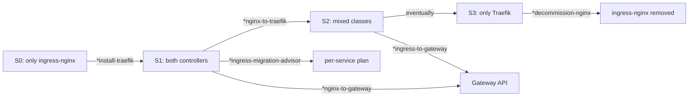

# migration-quickstart Pipeline

30-second orientation for the Ingress migration journey. Read-only,
non-interactive — prints a decision tree and the five migration
commands so a first-time operator knows which one to type next.

This pipeline owns no logic and produces no artifacts. It is pure
documentation rendered inline, kept here (rather than as a docs page)
so it surfaces as a Zeus slash command alongside the migration
commands it describes.

## When to use

- You have an `ingress-nginx` cluster and want to start the journey
  toward Traefik Ingress / Gateway API.
- You're staring at the 5 migration commands and don't know which one
  to type first.
- You're onboarding someone else and want a one-screen overview to
  share.

For a per-service plan with a deadline, use `*ingress-migration-advisor`
after reading this.

## Pipeline output

When Zeus runs this pipeline, print the following block verbatim, then
exit. No prompts, no scans.

---

```
INGRESS MIGRATION QUICKSTART — devops-ai-skill v1.13.0
=======================================================

You have an ingress-nginx cluster and want to migrate. Here's the path.

CLUSTER STATES
  S0 — ingress-nginx is the only controller
  S1 — Traefik is installed alongside ingress-nginx (both running)
  S2 — Services on a mix of nginx + traefik Ingresses
  S3 — Everything on Traefik, ready to retire ingress-nginx

DECISION TREE (default path: NGINX → Traefik Ingress → Gateway API)

  S0 ──▶ *install-traefik          (Zeus, GitOps Kustomize edits to common.traefik/)
  │                                 │
  │                                 ▼
  └─────────────────────────────▶  S1
                                    │
                                    ├──▶ *ingress-migration-advisor
                                    │      (Zeus, read-only, full-repo plan)
                                    │
                                    ├──▶ *nginx-to-traefik <env>
                                    │      (Zeus, class swap, one env)
                                    │
                                    └──▶ *nginx-to-gateway <env>
                                           (Zeus, full chain in one session)
                                                                    │
                                                                    ▼
                                                                   S2
                                                                    │
                                                                    ├──▶ *ingress-to-gateway <module>
                                                                    │      (Zeus, auto-detect source class)
                                                                    │
                                                                    └──▶ Eventually ──▶ S3
                                                                                         │
                                                                                         ▼
                                                                                  *decommission-nginx
                                                                                  (Zeus, archive module + ArgoCD prune)
```



```
THE FIVE MIGRATION COMMANDS

| Command                       | Agent | Scope             | When                                            |
|-------------------------------|-------|-------------------|-------------------------------------------------|
| *install-traefik              | Zeus  | common.traefik/   | Bootstrap/new-env/upgrade via Kustomize edits   |
| *nginx-to-traefik <env>       | Zeus  | One env / batch   | Class swap: stay on Ingress API                 |
| *nginx-to-gateway <env>       | Zeus  | One env           | Full chain: end on Gateway API                  |
| *gateway-migrate <module>     | Zeus  | One module        | Explicit source/target                          |
| *ingress-to-gateway <module>  | Zeus  | One module        | Auto-detect nginx vs traefik source             |
| *ingress-migration-advisor    | Zeus  | Whole repo        | Read-only planner; per-service path             |
| *decommission-nginx           | Zeus  | common.ingress-*  | Archive module + ArgoCD prune (NO helm uninstall) |

(Plus *gateway-migrate for explicit source/target — the underlying skill
the auto-detect command delegates to.)

WHAT TO RUN, BY STARTING STATE

  S0 (only ingress-nginx)
    1. *install-traefik             — stand up Traefik next door
    2. Wait for Traefik to be healthy (helm status; kubectl get pods)
    3. Then proceed as if S1.

  S1 (both controllers running)  — RECOMMENDED ENTRY POINT
    1. Create docs/ingress-tier-map.yaml (critical | standard | low per
       service). Without it, *ingress-migration-advisor halts.
    2. *ingress-migration-advisor --deadline <ISO-date>
       → produces docs/reports/ingress-migration-advisor/<slug>/plan.md
       with Mermaid Gantt + per-batch Zeus commands to copy-paste.
    3. Run the per-batch commands at your team's cadence.

  S2 (mixed classes after some swaps)
    1. *ingress-to-gateway <module>  — auto-detects per module
    2. On WARN (mixed in same module), pick one class and pass
       --source-class explicitly.

  S3 (everything on Traefik, nginx ready to retire)
    1. *decommission-nginx           — generates uninstall plan only
    2. Read the plan, run commands.sh by hand block-by-block

QUICK PATHS (skip the planner if you just want one service)

  Migrate one service via class-swap only:
    *nginx-to-traefik dev argocd-server

  Migrate one env all the way to Gateway API:
    *nginx-to-gateway dev --gateway-class traefik

  One module, auto-pick the path:
    *ingress-to-gateway common.service/overlays/dev

SAFETY DEFAULTS

  - Every migration skill is **plan-only or per-service-confirmed**.
  - DNS A-records are the cutover lever — never manipulated by any skill.
  - LB IPs are operator-declared; never derived from cluster state.
  - Critical services are vetoed by the advisor; PR the tier map to
    migrate them.
  - All reports land in docs/reports/<skill>/<slug>/ — git-add the
    report directory alongside the migration commit.

DOCS

  - docs/PROJECT.md                            project overview
  - docs/gateway/migrate-from-ingress.md       ingress2gateway notes
  - docs/superpowers/specs/                    design docs per skill
  - skills/<name>/SKILL.md                     full step-by-step per skill

NEXT STEP

  At S0?  → run *install-traefik
  At S1?  → run *ingress-migration-advisor (with --deadline)
  Just want one batch?  → run *nginx-to-traefik <env>
```

---

## Pipeline Steps

### Step 1: Print the orientation block

Print the entire block above verbatim. Use plain text rendering (no
syntax highlighting needed). The Mermaid block renders as a diagram
in editors that support it (GitHub, VS Code, Obsidian); falls back to
the code-block in plain terminals.

### Step 2: Exit cleanly

No state file. No prompts. No `kustomize build`. No git operations.

## Invocation Reference

```
*migration-quickstart
```

That's it. No flags, no arguments. Re-running it is always safe.

## Output Artifacts

None. This pipeline prints to stdout only.

## Maintenance

When a new migration command ships:
1. Add a row to the "Five Migration Commands" table.
2. Update the decision tree if the new command introduces a new state.
3. Update the structure test if a new TOML mirror is added.

The structure test asserts that every command name mentioned in this
pipeline corresponds to an existing file under `prompts/zeus/` or
`prompts/horus/`. If you rename a command, update this pipeline.
